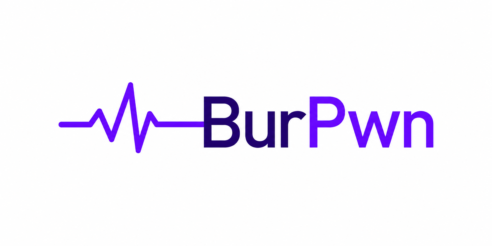

<p align="center">
  
</p>

<p align="center">
  <a href="https://github.com/own2pwn-fr/burpwn/actions/workflows/ci.yml"></a>
</p>

<p align="center">
  <b>A transparent intercepting proxy + execution sandbox + agent interface for AI-driven web pentesting.</b>
</p>

burpwn is to an AI agent what Burp Suite is to a human pentester. It runs every command an agent
executes inside a rootless Linux sandbox whose **entire** network (HTTP/HTTPS/DNS/TCP) is forced
through a built-in intercepting proxy. The agent can then go back through history, search and filter
the decrypted request/response flows, replay and edit them (Repeater), fuzz them with a native
Intruder, diff responses, encode/decode tokens, keep itself authenticated with a login macro, apply
match/replace rules, block and rewrite traffic in flight, and organize flows into workspaces — all
from a scriptable CLI or over MCP (31 tools). It is at once a Burp and a tshark, but driven by an
agent.

> **Status:** early development. See the milestones below.

## Why

Existing intercepting proxies are built for a human clicking in a GUI. An autonomous agent needs a
*programmatic* surface: create a session, run tooling, and query the captured traffic — without the
agent's own LLM traffic ever being captured. burpwn delivers exactly that: the agent process stays
**outside** the sandbox; only the commands it executes (its children) enter the captured network
namespace, so LLM traffic is excluded by construction.

## How it works

- **Rootless transparent sandbox.** Each executed command runs in its own Linux user + network
  namespace. An nftables `REDIRECT` ruleset inside that namespace forces all TCP (and UDP/53) to the
  burpwn proxy. bubblewrap isolates the filesystem and processes. No root, no setuid, no CAP_NET_ADMIN
  on the host — the kernel grants the needed capability *inside* the child namespace.
- **TLS-MITM.** A per-install root CA is generated once; leaf certs are minted on the fly per SNI and
  the CA is injected into the sandbox trust store so HTTPS is decrypted, capturing TLS metadata (SNI,
  negotiated HTTP version) alongside each flow. Cert-pinned targets fall back cleanly to TLS
  pass-through with metadata-only logging. QUIC/HTTP-3 (UDP/443) is fail-fast-rejected in the sandbox
  so clients gracefully downgrade to TCP and stay captured.
- **Full protocol coverage.** HTTP/1.1 and HTTP/2, streaming bodies (SSE / chunked / long-poll are
  tee'd to the store without buffering), and WebSocket upgrades captured as structured per-direction
  frames — plus DNS and raw-TCP metadata.
- **Capture & query.** Flows are stored in a per-session SQLite database (WAL, content-addressed body
  dedup, FTS5 full-text search) written by a single-writer task off the proxy hot path.
- **Offensive loop.** Beyond Repeater-style replay, burpwn has a native Intruder (`fuzz`, sniper /
  battering-ram / pitchfork / cluster-bomb, results ranked by anomaly), response `compare`,
  `encode`/`decode` (base64/url/hex/jwt), scoped blocking interception, and a session-auth login macro
  that auto-refreshes the token on 401/403 — so the tight probe loop never leaves the session.
- **Agent integration (rtk-style).** `burpwn init` installs the right command-rewrite hook for the
  detected agent (Claude Code / Copilot, Cursor, Gemini CLI, Cline/Roo), plus a generic global shell
  hook so even a custom agent is covered.

## Usage (target surface)

```sh
burpwn doctor                                  # prerequisites + a LIVE sandbox probe (--quick skips it)
burpwn ca init && burpwn ca export             # generate / print the MITM CA
burpwn session new --name engagement-1
burpwn exec -- curl -s https://target.example/ # runs sandboxed; traffic captured + decrypted
burpwn req list                                # browse captured flows
burpwn req show 42 --raw                       # decrypted request + response
burpwn req replay 42 --set-header 'X: 1'       # Repeater (also `req_replay` over MCP)
burpwn fuzz run --flow 42 --position 40:47 \
  --payloads words.txt --mode sniper           # native Intruder, results ranked by anomaly
burpwn fuzz show <attack_id> --sort anomaly    # per-payload results
burpwn compare 42 43 --what all                # structured diff + reflection check
burpwn decode jwt <token>                      # encode/decode base64(url)/url/hex/jwt
burpwn session auth set --login 'curl -s https://target.example/login -d u=a' \
  --extract '"token":"([^"]+)"' --header 'Authorization: Bearer {}'  # login-macro refresh on 401/403
burpwn intercept scope target.example --path /admin  # narrow blocking intercept
burpwn intercept enable                        # blocking intercept (also via MCP await_intercept)
burpwn session stats                           # capture-completeness: flags execs that captured nothing
burpwn init --check                            # verify each agent hook really rewrites to `burpwn exec`
```

## Install

Linux-only (relies on user/network namespaces, nftables, bubblewrap). Install the prerequisites
first — Fedora/RHEL: `sudo dnf install bubblewrap nftables iproute`; Debian/Ubuntu:
`sudo apt install bubblewrap nftables iproute2`.

> **WSL is not supported.** The Microsoft WSL2 kernel ships **no loadable modules**, and the
> features the sandbox needs are built as modules there (`CONFIG_DUMMY=m`, `CONFIG_NFT_REDIR=m`,
> `CONFIG_NF_REJECT_IPV4=m`). `ip` and `nft` are installed and *look* fine, but `ip link add …
> type dummy` and the nftables `redirect` expression fail at runtime, so nothing can be captured.
> `burpwn doctor` detects this exactly (it really creates a throwaway sandbox) and says so. Use a
> real Linux host/VM, or boot WSL on a custom kernel built with those options set to `=y`.

```sh
# one-liner: download the prebuilt binary, install to ~/.local/bin, generate the CA, run preflight
curl -fsSL https://raw.githubusercontent.com/own2pwn-fr/burpwn/main/install.sh | sh

# from a checkout (builds from source if no prebuilt binary fits your arch)
./install.sh                # ./install.sh --hooks also installs the global shell hook
./install.sh --from-source  # force a source build

# or via cargo / the Makefile
cargo install --git https://github.com/own2pwn-fr/burpwn burpwn
make install                # PREFIX=/usr/local make install  (may need sudo); `make help` lists tasks
```

The `curl | sh` path downloads the release binary for your architecture (x86_64 / aarch64 Linux) and
verifies its checksum; if none matches it falls back to a `cargo` source build.

## Build (from source)

```sh
cargo build --release    # produces a single `burpwn` binary at target/release/burpwn
cargo test               # the privileged rootless-sandbox test is #[ignore]d
```

## Agent integration

There are two integration layers. The **skill** is the recommended default; the **hook** is an
explicit opt-in. They are not meant to be stacked.

### Skill (recommended)

The bundled agent skill ([`skills/burpwn/`](./skills/burpwn)) teaches the agent the workflow:
create a named session first, then route **target-facing** network commands through
`burpwn exec`, and query/replay/intercept the captures. It is *selective* (only the commands that
touch the target are sandboxed) and *session-aware* — no surprise sandboxing of `ls`/`git`/builds,
and no captures landing in an unnamed default session.

#### Install the skill (per framework)

Two portable commands cover every supported agent — one installs the skill in the framework's
**native** format (skill dir, rules file, or an `AGENTS.md` append), the other registers the MCP
tools for the hosts that speak stdio MCP:

```sh
burpwn skill install --agent <framework>   # teach the agent the workflow
burpwn mcp register --agent <framework>    # give it the tools (MCP hosts)
```

`skill install` writes into the **project** by default; pass `--global` for the per-user location,
`--all` to target every known framework at once, `--print` to preview without writing, and
`--force` to overwrite a burpwn-owned block. It is idempotent and anti-clobber: re-running is safe
and it never overwrites content it didn't author. Manage installs with `burpwn skill list` and
`burpwn skill uninstall --agent <slug>`; list MCP hosts with `burpwn mcp register --list`.

Pick your framework:

<details>
<summary><b>Claude Code</b> — skill dir</summary>

```sh
burpwn skill install --agent claude-code            # → .claude/skills/burpwn/SKILL.md
burpwn skill install --agent claude-code --global   # → ~/.claude/skills/burpwn/SKILL.md
```

This repo is also a **plugin marketplace**, so on Claude Code you can instead install via the
plugin (the `burpwn` binary must already be on `PATH`):

```sh
# in Claude Code:
/plugin marketplace add own2pwn-fr/burpwn
/plugin install burpwn@burpwn
```
</details>

<details>
<summary><b>Cursor</b> — rules file</summary>

```sh
burpwn skill install --agent cursor   # → .cursor/rules/burpwn.mdc
```

Project only — Cursor has no file-based global rules.
</details>

<details>
<summary><b>Cline / Roo</b> — rules file</summary>

```sh
burpwn skill install --agent cline   # → .clinerules/burpwn.md
```

Project only.
</details>

<details>
<summary><b>Gemini CLI</b> — AGENTS.md-style append (GEMINI.md)</summary>

```sh
burpwn skill install --agent gemini            # → GEMINI.md
burpwn skill install --agent gemini --global   # → ~/.gemini/GEMINI.md
```
</details>

<details>
<summary><b>Codex</b> — AGENTS.md append + MCP</summary>

```sh
burpwn skill install --agent codex            # → AGENTS.md
burpwn skill install --agent codex --global   # → ~/.codex/AGENTS.md
burpwn mcp register --agent codex             # → ~/.codex/config.toml  ([mcp_servers.burpwn])
```

⚠️ **Codex network caveat:** the default `workspace-write` sandbox blocks outbound network, so
burpwn's target traffic is blocked. Enable it in `~/.codex/config.toml`:

```toml
[sandbox_workspace_write]
network_access = true
```

(or run Codex with full access). Without this, wrapped commands can't reach the target.
</details>

<details>
<summary><b>GitHub Copilot CLI</b> — instructions append + MCP</summary>

```sh
burpwn skill install --agent copilot   # → .github/copilot-instructions.md  (project only)
burpwn mcp register --agent copilot    # → ~/.copilot/mcp-config.json
```
</details>

<details>
<summary><b>Antigravity</b> — AGENTS.md append + MCP</summary>

```sh
burpwn skill install --agent antigravity   # → AGENTS.md  (project only)
burpwn mcp register --agent antigravity    # → ~/.gemini/config/mcp_config.json
```
</details>

<details>
<summary><b>Strix</b> — skill dir (no stdio MCP)</summary>

```sh
burpwn skill install --agent strix   # → .strix/skills/burpwn/SKILL.md  (project only)
```

Strix has no stdio MCP (it runs tools via a Docker sandbox shell), so the path is the skill plus
shelling out to `burpwn exec`. Note: the skills-dir path is best-effort — confirm Strix's skills
directory for your version.
</details>

<details>
<summary><b>Any other agent (generic)</b> — AGENTS.md</summary>

```sh
burpwn skill install --agent agents   # → AGENTS.md  (any AGENTS.md-aware agent)
burpwn mcp register --agent <slug>    # if the agent speaks stdio MCP
```

For an agent with neither native skills nor stdio MCP, install the generic skill and have it shell
out to `burpwn exec` (or the `burpwn-shell` wrapper) for target-facing commands.
</details>

### Hook (opt-in: enforced auto-capture)

`burpwn init` installs an rtk-style command-rewrite hook so **every** shell command is auto-routed
through `burpwn exec`. This guarantees capture even if the model forgets to wrap a command — but it
sandboxes *all* commands (not just network ones) and does not create a session for you (captures go
to the active/default session). Use it only when you want enforced capture and accept that trade-off.

```sh
burpwn init --agent claude   # Claude Code / Copilot PreToolUse hook (also: cursor, gemini, cline)
burpwn init --global         # generic shell hook — works for any agent
burpwn mcp                   # MCP server over stdio (session/exec/req/intercept tools)
```

Hook support differs by what each agent's hook API allows:

| Agent | Mechanism | Auto-rewrites commands? |
|-------|-----------|-------------------------|
| Claude Code / Copilot | `PreToolUse` (`updatedInput`) | **Yes** — transparent |
| Gemini CLI | `BeforeTool` (`hookSpecificOutput.tool_input`) | **Yes** — transparent |
| Cursor | `beforeShellExecution` | No — its hook can only allow/deny, so burpwn emits a non-blocking nudge; rely on the skill rule to prefix `burpwn exec` |
| Cline / Roo | `.clinerules` text | No — advisory (model-followed) |

## License

[AGPL-3.0-only](./LICENSE).
